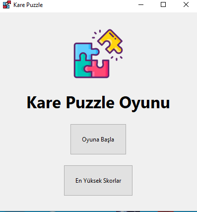
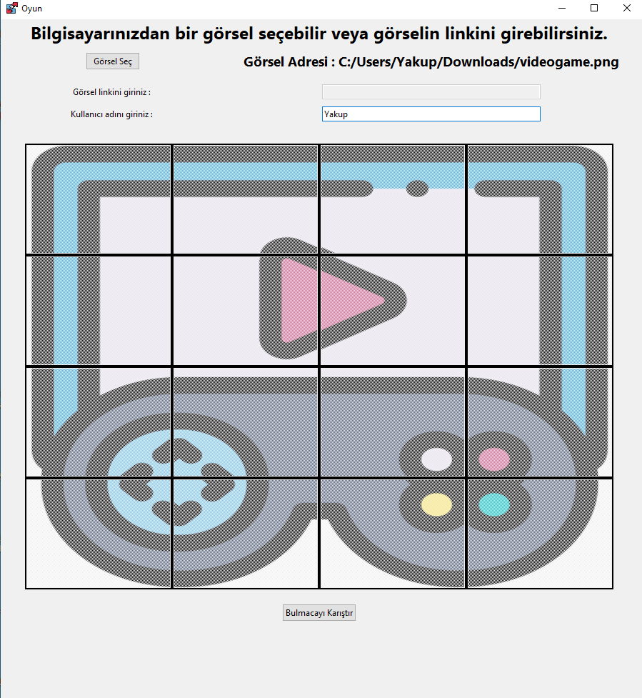
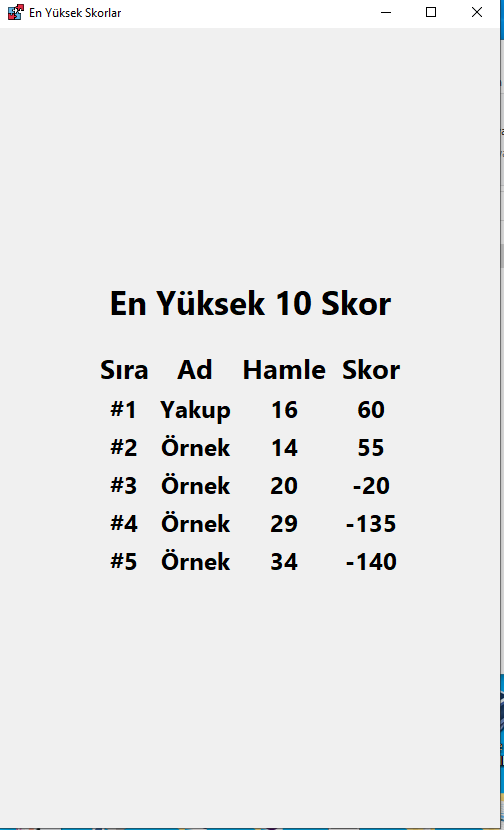

# Proje Özeti

Bu proje, 16 parçalı bir puzzle çözme oyununu içermektedir. Kullanıcı arayüzü, Python 3.8.16 sürümü ve Tkinter kütüphanesi kullanılarak tasarlanmıştır. Oyunun amacı, kullanıcının 16 parçalı bir görseli doğru şekilde yerleştirerek tamamlamasıdır. Puzzle parçaları, bir bağlı liste veri yapısı kullanılarak eşleştirilir.

# Geliştirme Ortamı

Bu proje, Python 3.8.16 ve Tkinter kütüphanesi kullanılarak geliştirilmiştir. Geliştirme işlemleri, Visual Studio Code gibi bir kod editörü kullanılarak gerçekleştirilmiştir. Proje geliştirme sürecinde, GitHub gibi bir kod paylaşım platformu kullanılmıştır.

# Projeyi Yükleme ve Çalıştırma

1. Projeyi GitHub'dan indirin veya klonlayın.
2. Projeyi açın ve terminale gidin.
3. Gerekli kütüphaneleri ```pip install <kütüphane>``` ile yükleyin.
4. Projenin bulunduğu dizinde, terminalde şu komutu çalıştırın: ```python main.py```
5. Oyunun arayüzü açılacaktır ve oynamaya başlayabilirsiniz.

# Görsel Arayüz

**Ana Menü** 




**Oyun Ekranı** 



**En Yüksek 10 Skor** 

